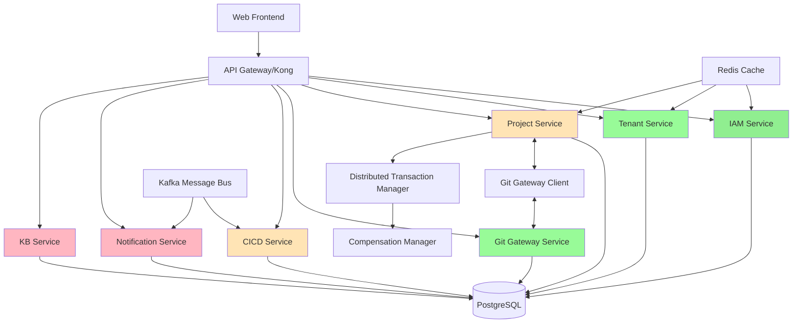

# 企业级云端协作开发平台 - 架构评估报告

## 架构概览



## 架构优势分析 ✅

### 1. 多租户架构设计 (优秀)
```go
// 发现的优秀实现：数据库层面的RLS + 应用层双重隔离
type TenantContext struct {
    TenantID uuid.UUID
}

func (db *PostgresDB) WithContext(ctx context.Context, tenantCtx TenantContext) *gorm.DB {
    return db.DB.WithContext(ctx).Where("tenant_id = ?", tenantCtx.TenantID)
}
```

**优势**:
- 数据库行级安全策略(RLS)作为第一道防线
- 应用层租户上下文作为第二道防线  
- UUID v7时间排序特性提升查询性能
- 完整的租户配额和订阅管理

### 2. 身份认证架构 (企业级标准)
```go
// JWT Claims结构专业完善
type Claims struct {
    UserID      uuid.UUID `json:"user_id"`
    TenantID    uuid.UUID `json:"tenant_id"`
    Email       string    `json:"email"`
    Role        string    `json:"role"`
    Permissions []string  `json:"permissions"`
    TokenType   string    `json:"token_type"`
}
```

**优势**:
- 访问令牌和刷新令牌分离设计
- MFA多因子认证完整实现
- 会话管理支持并发控制
- SSO单点登录支持多种协议

### 3. 微服务通信机制 (设计合理)
```go
// Git网关客户端接口设计完善
type GitGatewayClient interface {
    CreateRepository(ctx context.Context, req *CreateRepositoryRequest) (*Repository, error)
    GetRepository(ctx context.Context, repositoryID uuid.UUID) (*Repository, error)
    // ... 完整的Git操作接口
}
```

**优势**:
- HTTP/REST API通信简单可靠
- 客户端接口设计完整
- 支持上下文传递和超时控制
- 错误处理机制统一

## 架构问题诊断 ❌

### 1. 过度工程化风险 (严重)

**问题**: 分布式事务Saga模式在当前业务复杂度下过度设计

```go
// 当前实现过于复杂
type DistributedTransactionManager struct {
    projectRepo       repository.ProjectRepository
    gitClient         client.GitGatewayClient
    compensationMgr   *compensation.CompensationManager
    logger            *zap.Logger
}

// 补偿机制实现复杂
type CompensationEntry struct {
    ID          uuid.UUID          
    Action      CompensationAction 
    ResourceID  uuid.UUID         
    Payload     map[string]interface{} 
    RetryCount  int               
    MaxRetries  int               
    LastError   string            
}
```

**影响**:
- 增加系统复杂度，提高故障概率
- 调试和维护成本高
- 性能开销不必要
- 团队学习曲线陡峭

**建议**: 在MVP阶段，数据库本地事务 + 幂等性重试更实用

### 2. 服务间通信缺乏弹性 (中等)

**问题**: 缺少熔断、限流、重试机制

```go
// 当前HTTP客户端缺乏弹性机制
func (c *gitGatewayClient) CreateRepository(ctx context.Context, req *CreateRepositoryRequest) (*Repository, error) {
    // 直接HTTP调用，没有熔断保护
    resp, err := c.httpClient.Post(url, "application/json", body)
    if err != nil {
        return nil, err // 直接失败，没有重试
    }
    // ...
}
```

**建议**:
```go
// 应该实现的弹性机制
type ResilientHTTPClient struct {
    httpClient *http.Client
    circuitBreaker *CircuitBreaker
    retryPolicy *RetryPolicy
    rateLimiter *rate.Limiter
}
```

### 3. 监控和可观测性不足 (高风险)

**缺失的关键组件**:
- 分布式链路追踪 (Jaeger/Zipkin)
- 服务网格 (Istio/Linkerd)
- 业务指标监控 (Prometheus/Grafana)
- 日志聚合 (ELK Stack)

**影响**: 生产环境问题排查困难，性能瓶颈难以定位

### 4. 数据一致性风险 (中等)

**问题**: 跨服务数据操作缺乏一致性保证

```go
// 当前实现可能导致数据不一致
func (s *ProjectService) CreateProject(ctx context.Context, req *CreateProjectRequest) (*Project, error) {
    // 1. 创建项目记录
    project, err := s.repo.CreateProject(ctx, req)
    if err != nil {
        return nil, err
    }
    
    // 2. 调用Git服务创建仓库 (可能失败)
    repo, err := s.gitClient.CreateRepository(ctx, &CreateRepoReq{
        ProjectID: project.ID,
        Name:      req.RepositoryName,
    })
    if err != nil {
        // 项目已创建，但仓库创建失败 - 数据不一致！
        return nil, err
    }
    
    return project, nil
}
```

**建议**: 实现最终一致性模式或使用消息队列确保数据一致性

## 性能瓶颈分析

### 1. 数据库查询优化需求
```sql
-- 缺失的关键索引
CREATE INDEX CONCURRENTLY idx_users_tenant_email ON users(tenant_id, email);
CREATE INDEX CONCURRENTLY idx_projects_tenant_status ON projects(tenant_id, status);
CREATE INDEX CONCURRENTLY idx_tasks_project_priority ON tasks(project_id, priority, status);
CREATE INDEX CONCURRENTLY idx_repositories_project_active ON repositories(project_id, is_active);
```

### 2. 缓存策略不完整
```go
// 当前缓存实现过于简单
type CacheConfig struct {
    DefaultTTL      time.Duration `yaml:"default_ttl"`
    CleanupInterval time.Duration `yaml:"cleanup_interval"`
    MaxEntries      int           `yaml:"max_entries"`
}

// 建议实现分层缓存
type LayeredCache struct {
    L1 *sync.Map        // 本地内存缓存
    L2 *redis.Client    // Redis分布式缓存  
    L3 *sql.DB         // 数据库查询缓存
}
```

### 3. 连接池配置需要优化
```yaml
# 当前数据库连接配置
database:
  max_open_conns: 25    # 可能不够
  max_idle_conns: 5     # 过低
  conn_max_lifetime: "300s"
  
# 建议优化为
database:
  max_open_conns: 100   # 根据并发量调整
  max_idle_conns: 20    # 提高复用率
  conn_max_lifetime: "1h"
```

## 安全架构评估

### 优势
1. **认证机制完善**: JWT + MFA + SSO
2. **授权控制严格**: RBAC + 租户隔离
3. **数据保护**: RLS + 加密传输
4. **会话管理**: 并发控制 + 设备管理

### 风险点
1. **缺少API限流**: 容易受到DDoS攻击
2. **缺少WAF防护**: XSS、SQL注入风险
3. **缺少安全扫描**: SAST/SCA集成缺失
4. **缺少运行时保护**: 异常行为检测不足

## 架构改进建议

### 1. 简化分布式事务 (立即执行)
```go
// 建议的简化方案
type SimpleTransactionManager struct {
    db     *gorm.DB
    logger *zap.Logger
}

func (tm *SimpleTransactionManager) CreateProjectWithRepository(
    ctx context.Context, 
    projectReq *CreateProjectRequest,
) error {
    return tm.db.Transaction(func(tx *gorm.DB) error {
        // 1. 创建项目
        project, err := tm.createProject(tx, projectReq)
        if err != nil {
            return err
        }
        
        // 2. 异步创建Git仓库 (使用消息队列)
        return tm.publishRepoCreationEvent(project.ID, projectReq.RepositoryName)
    })
}
```

### 2. 实现服务间弹性机制 (高优先级)
```go
type ResilientServiceClient struct {
    baseURL        string
    httpClient     *http.Client
    circuitBreaker *breaker.CircuitBreaker
    retryConfig    RetryConfig
    rateLimiter    *rate.Limiter
}

type RetryConfig struct {
    MaxAttempts int
    InitialDelay time.Duration
    MaxDelay     time.Duration
    Multiplier   float64
}
```

### 3. 完善监控体系 (中优先级)
```yaml
# 建议的监控架构
monitoring:
  metrics:
    prometheus: 
      enabled: true
      port: 9090
    grafana:
      enabled: true
      port: 3000
  tracing:
    jaeger:
      enabled: true
      endpoint: "http://jaeger:14268/api/traces"
    sampling_rate: 0.1
  logging:
    elasticsearch:
      enabled: true
      endpoint: "http://elasticsearch:9200"
    logstash:
      enabled: true
    kibana:
      enabled: true
```

### 4. 优化数据访问层 (中优先级)
```go
// 建议的数据访问优化
type OptimizedRepository struct {
    db    *gorm.DB
    cache LayeredCache
    
    // 查询优化
    preparedStmts map[string]*sql.Stmt
    
    // 批量操作
    batchSize     int
    batchTimeout  time.Duration
}

// 实现读写分离
type ReadWriteSplitter struct {
    readDB  *gorm.DB
    writeDB *gorm.DB
}
```

## 部署架构建议

### 1. Kubernetes部署优化
```yaml
# 高可用部署配置
apiVersion: apps/v1
kind: Deployment
metadata:
  name: project-service
spec:
  replicas: 3
  strategy:
    type: RollingUpdate
    rollingUpdate:
      maxSurge: 1
      maxUnavailable: 0
  template:
    spec:
      containers:
      - name: project-service
        image: project-service:v1.0.0
        resources:
          requests:
            memory: "512Mi"
            cpu: "300m"
          limits:
            memory: "1Gi"  
            cpu: "600m"
        livenessProbe:
          httpGet:
            path: /api/v1/health
            port: 8080
          initialDelaySeconds: 30
          periodSeconds: 10
        readinessProbe:
          httpGet:
            path: /api/v1/ready
            port: 8080
          initialDelaySeconds: 5
          periodSeconds: 5
```

### 2. 服务网格集成
```yaml
# Istio配置示例  
apiVersion: networking.istio.io/v1beta1
kind: VirtualService
metadata:
  name: project-service
spec:
  hosts:
  - project-service
  http:
  - timeout: 10s
    retries:
      attempts: 3
      perTryTimeout: 3s
    route:
    - destination:
        host: project-service
```

## 技术债务分析

### 高优先级技术债务
1. **分布式事务过度设计** - 影响性能和维护性
2. **监控体系缺失** - 影响生产环境稳定性  
3. **服务间通信不够健壮** - 影响系统可靠性
4. **缓存策略简陋** - 影响性能扩展性

### 中优先级技术债务  
1. **数据库索引不完整** - 影响查询性能
2. **API文档不完整** - 影响开发效率
3. **单元测试覆盖率不足** - 影响代码质量
4. **配置管理需要优化** - 影响部署灵活性

### 低优先级技术债务
1. **代码注释需要补充** - 影响代码可维护性
2. **日志记录需要标准化** - 影响问题排查
3. **错误处理需要统一** - 影响用户体验

## 总结与行动建议

### 架构成熟度评分
- **整体架构设计**: 8/10 (设计专业，但存在过度工程化)  
- **安全架构**: 9/10 (认证授权完善，但缺少运行时防护)
- **性能架构**: 6/10 (基础良好，但缺少优化)
- **可维护性**: 7/10 (代码质量高，但复杂度过高)
- **可扩展性**: 8/10 (微服务架构支持水平扩展)

### 立即行动项目 (1-2周)
1. 简化分布式事务实现
2. 添加服务间弹性机制  
3. 实现基础监控和告警
4. 优化数据库索引

### 中期改进项目 (2-4周)
1. 完善可观测性体系
2. 实现分层缓存策略
3. 添加自动化测试
4. 优化部署架构

### 长期演进方向 (1-3个月)
1. 服务网格集成
2. 多云部署支持  
3. 智能监控和AIOps
4. 更细粒度的微服务拆分

**结论**: 您的架构设计专业且安全，但存在过度工程化倾向。建议优先简化复杂机制，完善监控体系，在保证功能完整性的同时提升系统的可维护性和可靠性。