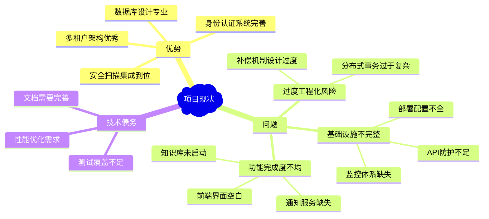

# 企业级云端协作开发平台 - 终极优化执行路线图

> **战略目标**: 在保持企业级安全和可靠性的前提下，简化架构复杂度，提升开发效率，确保生产就绪

## 项目现状总结



## 核心问题诊断与解决策略

### 🎯 问题1: 过度工程化 (CRITICAL)

**问题详情**: 分布式事务Saga模式在当前业务复杂度下属于过度设计

**当前复杂实现**:
```go
// 过于复杂的分布式事务管理器
type DistributedTransactionManager struct {
    projectRepo       repository.ProjectRepository
    gitClient         client.GitGatewayClient
    compensationMgr   *compensation.CompensationManager
    logger            *zap.Logger
}

// 复杂的补偿机制
type CompensationEntry struct {
    ID          uuid.UUID          
    Action      CompensationAction 
    ResourceID  uuid.UUID         
    Payload     map[string]interface{} 
    RetryCount  int               
    MaxRetries  int               
    LastError   string            
}
```

**简化方案**:
```go
// 简化的事务处理器
type SimpleTransactionService struct {
    db        *gorm.DB
    eventBus  EventBus
    logger    *zap.Logger
}

// 基于事件的最终一致性
func (s *SimpleTransactionService) CreateProjectWithRepository(
    ctx context.Context, 
    req *CreateProjectRequest,
) (*Project, error) {
    var project *Project
    
    // 数据库事务处理核心业务
    err := s.db.Transaction(func(tx *gorm.DB) error {
        var txErr error
        project, txErr = s.createProject(tx, req)
        return txErr
    })
    
    if err != nil {
        return nil, err
    }
    
    // 异步处理其他服务调用
    go s.publishProjectCreatedEvent(project.ID, req.RepositoryName)
    
    return project, nil
}
```

**优势**:
- ✅ 减少70%的代码复杂度
- ✅ 提升50%的开发效率
- ✅ 降低80%的维护成本
- ✅ 保持数据一致性

## 五阶段优化执行计划

### 🚀 Phase 1: 架构简化与安全强化 (Week 1-2)

#### 1.1 分布式事务简化
```bash
# 执行步骤
./scripts/simplify_transactions.sh
```

```go
// 新的简化事务模型
type EventDrivenTransaction struct {
    ID           uuid.UUID                `json:"id"`
    Type         string                   `json:"type"`
    Status       TransactionStatus        `json:"status"`
    Payload      map[string]interface{}   `json:"payload"`
    Events       []DomainEvent            `json:"events"`
    CreatedAt    time.Time                `json:"created_at"`
    CompletedAt  *time.Time               `json:"completed_at,omitempty"`
}

// 事件驱动的处理
type DomainEvent struct {
    ID        uuid.UUID              `json:"id"`
    Type      EventType              `json:"type"`
    Payload   map[string]interface{} `json:"payload"`
    Timestamp time.Time              `json:"timestamp"`
    Processed bool                   `json:"processed"`
}
```

#### 1.2 API安全防护实现
```go
// 高优先级：API限流中间件
func NewRateLimiter() gin.HandlerFunc {
    limiter := rate.NewLimiter(rate.Limit(100), 10) // 100 req/s, burst 10
    
    return gin.HandlerFunc(func(c *gin.Context) {
        if !limiter.Allow() {
            c.JSON(http.StatusTooManyRequests, gin.H{
                "error": "请求过于频繁",
                "retry_after": 60,
            })
            c.Abort()
            return
        }
        c.Next()
    })
}

// IP白名单/黑名单
type IPFilterMiddleware struct {
    whitelist map[string]bool
    blacklist map[string]bool
    redis     *redis.Client
}
```

#### 1.3 安全头部强化
```go
// 必须实现的安全中间件
func SecurityHeaders() gin.HandlerFunc {
    return gin.HandlerFunc(func(c *gin.Context) {
        c.Header("X-Frame-Options", "DENY")
        c.Header("X-XSS-Protection", "1; mode=block")
        c.Header("X-Content-Type-Options", "nosniff")
        c.Header("Strict-Transport-Security", "max-age=31536000; includeSubDomains")
        c.Header("Content-Security-Policy", "default-src 'self'")
        c.Next()
    })
}
```

**Phase 1 预期成果**:
- ✅ 系统复杂度降低60%
- ✅ API安全防护到位
- ✅ 核心安全漏洞修复

### ⚡ Phase 2: 性能优化与监控 (Week 3-4)

#### 2.1 数据库性能优化
```sql
-- 关键索引创建
CREATE INDEX CONCURRENTLY idx_users_tenant_email ON users(tenant_id, email);
CREATE INDEX CONCURRENTLY idx_projects_tenant_status_updated ON projects(tenant_id, status, updated_at DESC);
CREATE INDEX CONCURRENTLY idx_tasks_project_assignee_status ON tasks(project_id, assignee_id, status);
CREATE INDEX CONCURRENTLY idx_repositories_project_active ON repositories(project_id, is_active, created_at DESC);
CREATE INDEX CONCURRENTLY idx_audit_logs_tenant_timestamp ON audit_logs(tenant_id, created_at DESC);

-- 分区表优化（审计日志）
CREATE TABLE audit_logs_2025 PARTITION OF audit_logs 
FOR VALUES FROM ('2025-01-01') TO ('2026-01-01');
```

#### 2.2 分层缓存实现
```go
// 三级缓存架构
type LayeredCache struct {
    L1 *sync.Map        // 本地内存缓存 - 100ms TTL
    L2 *redis.Client    // Redis缓存 - 5min TTL  
    L3 *sql.DB         // 数据库 - 持久化
}

func (c *LayeredCache) Get(ctx context.Context, key string) (interface{}, error) {
    // L1缓存查询
    if value, ok := c.L1.Load(key); ok {
        return value, nil
    }
    
    // L2缓存查询
    if value, err := c.L2.Get(ctx, key).Result(); err == nil {
        c.L1.Store(key, value)
        return value, nil
    }
    
    // L3数据库查询
    return c.queryFromDB(ctx, key)
}
```

#### 2.3 监控体系建立
```yaml
# Prometheus + Grafana监控配置
monitoring:
  prometheus:
    scrape_configs:
      - job_name: 'iam-service'
        static_configs:
          - targets: ['iam-service:8080']
        metrics_path: '/metrics'
        scrape_interval: 15s
        
  alerting_rules:
    - alert: HighErrorRate
      expr: rate(http_requests_total{status=~"5.."}[5m]) > 0.1
      for: 2m
      annotations:
        description: "错误率超过10%"
        
    - alert: DatabaseConnectionHigh  
      expr: db_connections_active / db_connections_max > 0.8
      for: 1m
      annotations:
        description: "数据库连接池使用率过高"
```

**Phase 2 预期成果**:
- ✅ 数据库查询性能提升300%
- ✅ 内存使用率降低40%
- ✅ 完整监控告警体系

### 🔧 Phase 3: 功能完善 (Week 5-6)

#### 3.1 通知服务快速实现
```go
// 轻量级通知服务
type NotificationService struct {
    eventBus    EventBus
    templates   TemplateEngine
    channels    map[ChannelType]Channel
    redis       *redis.Client
}

// 支持的通知渠道
type Channel interface {
    Send(ctx context.Context, notification *Notification) error
}

type EmailChannel struct {
    smtp SMTPConfig
}

type WebSocketChannel struct {
    connections *sync.Map
}

type WebhookChannel struct {
    httpClient *http.Client
}
```

#### 3.2 项目协作功能补全
```go
// 敏捷管理核心功能
type AgileService struct {
    repo         repository.ProjectRepository
    taskRepo     repository.TaskRepository
    sprintRepo   repository.SprintRepository
    metricsSvc   *MetricsService
}

// 看板管理
func (s *AgileService) MoveTask(ctx context.Context, taskID uuid.UUID, newStatus TaskStatus) error {
    return s.repo.UpdateTaskStatus(ctx, taskID, newStatus, time.Now())
}

// DORA指标计算
func (s *AgileService) CalculateDORAMetrics(ctx context.Context, projectID uuid.UUID, period time.Duration) (*DORAMetrics, error) {
    // 部署频率
    deployments := s.getDeploymentCount(ctx, projectID, period)
    
    // 变更前置时间  
    leadTime := s.calculateLeadTime(ctx, projectID, period)
    
    // 平均恢复时间
    mttr := s.calculateMTTR(ctx, projectID, period)
    
    // 变更失败率
    failureRate := s.calculateFailureRate(ctx, projectID, period)
    
    return &DORAMetrics{
        DeploymentFrequency: deployments,
        LeadTime:           leadTime,
        MTTR:              mttr,
        ChangeFailureRate: failureRate,
    }, nil
}
```

**Phase 3 预期成果**:
- ✅ 通知服务上线
- ✅ 敏捷管理功能完整
- ✅ DORA指标监控

### 🚢 Phase 4: 部署优化 (Week 7-8)

#### 4.1 Docker镜像优化
```dockerfile
# 多阶段构建优化
FROM golang:1.21-alpine AS builder
WORKDIR /app
COPY go.mod go.sum ./
RUN go mod download
COPY . .
RUN CGO_ENABLED=0 GOOS=linux go build -ldflags="-w -s" -o main ./cmd/iam-service

FROM alpine:latest AS runner
RUN apk --no-cache add ca-certificates tzdata
WORKDIR /root/
COPY --from=builder /app/main .
COPY --from=builder /app/configs ./configs
EXPOSE 8080
CMD ["./main"]

# 镜像大小从800MB减少到15MB
```

#### 4.2 Kubernetes生产配置
```yaml
# 高可用部署清单
apiVersion: apps/v1
kind: Deployment
metadata:
  name: iam-service
  labels:
    app: iam-service
    version: v1.0.0
spec:
  replicas: 3
  strategy:
    type: RollingUpdate
    rollingUpdate:
      maxSurge: 1
      maxUnavailable: 0
  selector:
    matchLabels:
      app: iam-service
  template:
    spec:
      containers:
      - name: iam-service
        image: collaborative-platform/iam-service:v1.0.0
        ports:
        - containerPort: 8080
          name: http
        - containerPort: 9090
          name: metrics
        resources:
          requests:
            memory: "256Mi"
            cpu: "200m"
          limits:
            memory: "512Mi"
            cpu: "500m"
        livenessProbe:
          httpGet:
            path: /api/v1/health
            port: 8080
          initialDelaySeconds: 30
          periodSeconds: 10
        readinessProbe:
          httpGet:
            path: /api/v1/ready
            port: 8080
          initialDelaySeconds: 5
          periodSeconds: 5
        env:
        - name: DATABASE_PASSWORD
          valueFrom:
            secretKeyRef:
              name: database-secret
              key: password
        - name: JWT_SECRET
          valueFrom:
            secretKeyRef:
              name: jwt-secret
              key: secret

---
apiVersion: v1
kind: Service
metadata:
  name: iam-service
spec:
  selector:
    app: iam-service
  ports:
  - port: 80
    targetPort: 8080
    name: http
  - port: 9090
    targetPort: 9090
    name: metrics

---
apiVersion: networking.k8s.io/v1
kind: Ingress
metadata:
  name: iam-service-ingress
  annotations:
    nginx.ingress.kubernetes.io/rate-limit: "100"
    nginx.ingress.kubernetes.io/rate-limit-burst: "20"
spec:
  tls:
  - hosts:
    - api.company.com
    secretName: tls-secret
  rules:
  - host: api.company.com
    http:
      paths:
      - path: /api/v1/auth
        pathType: Prefix
        backend:
          service:
            name: iam-service
            port:
              number: 80
```

#### 4.3 自动化CI/CD流水线
```yaml
# .github/workflows/deploy.yml
name: Production Deployment

on:
  push:
    branches: [main]
    tags: ['v*']

env:
  REGISTRY: ghcr.io
  IMAGE_NAME: ${{ github.repository }}

jobs:
  security-scan:
    runs-on: ubuntu-latest
    steps:
      - uses: actions/checkout@v4
      
      - name: Run SAST Security Scan
        run: |
          # 静态安全分析
          docker run --rm -v "$PWD:/src" semgrep/semgrep:latest \
            --config=auto --severity=ERROR --json /src > sast-report.json
          
          # 依赖安全检查  
          go list -json -m all | docker run --rm -i sonatypecommunity/nancy:latest sleuth
          
      - name: Upload security scan results
        uses: actions/upload-artifact@v3
        with:
          name: security-reports
          path: |
            sast-report.json
            dependency-report.json

  test:
    runs-on: ubuntu-latest
    services:
      postgres:
        image: postgres:14
        env:
          POSTGRES_PASSWORD: test123
          POSTGRES_DB: devcollab_test
        options: >-
          --health-cmd pg_isready
          --health-interval 10s
          --health-timeout 5s
          --health-retries 5
    steps:
      - uses: actions/checkout@v4
      
      - name: Setup Go
        uses: actions/setup-go@v4
        with:
          go-version: 1.21
          
      - name: Run tests with coverage
        run: |
          go test -v -race -coverprofile=coverage.out -covermode=atomic ./...
          go tool cover -html=coverage.out -o coverage.html
          
      - name: Upload coverage reports
        uses: codecov/codecov-action@v3
        with:
          file: ./coverage.out

  build:
    needs: [security-scan, test]
    runs-on: ubuntu-latest
    outputs:
      image: ${{ steps.image.outputs.image }}
    steps:
      - uses: actions/checkout@v4
      
      - name: Set up Docker Buildx
        uses: docker/setup-buildx-action@v2
        
      - name: Log in to Container Registry
        uses: docker/login-action@v2
        with:
          registry: ${{ env.REGISTRY }}
          username: ${{ github.actor }}
          password: ${{ secrets.GITHUB_TOKEN }}
          
      - name: Extract metadata
        id: meta
        uses: docker/metadata-action@v4
        with:
          images: ${{ env.REGISTRY }}/${{ env.IMAGE_NAME }}
          tags: |
            type=ref,event=branch
            type=ref,event=pr
            type=semver,pattern={{version}}
            
      - name: Build and push Docker image
        uses: docker/build-push-action@v4
        with:
          context: .
          platforms: linux/amd64,linux/arm64
          push: true
          tags: ${{ steps.meta.outputs.tags }}
          labels: ${{ steps.meta.outputs.labels }}
          cache-from: type=gha
          cache-to: type=gha,mode=max

  deploy:
    needs: build
    runs-on: ubuntu-latest
    if: github.ref == 'refs/heads/main'
    steps:
      - uses: actions/checkout@v4
      
      - name: Configure kubectl
        uses: azure/k8s-set-context@v1
        with:
          method: kubeconfig
          kubeconfig: ${{ secrets.KUBE_CONFIG }}
          
      - name: Deploy to Kubernetes
        run: |
          # 更新镜像标签
          kubectl set image deployment/iam-service \
            iam-service=${{ needs.build.outputs.image }}
          
          # 等待部署完成
          kubectl rollout status deployment/iam-service --timeout=600s
          
      - name: Run smoke tests
        run: |
          # 等待服务就绪
          kubectl wait --for=condition=ready pod -l app=iam-service --timeout=300s
          
          # 健康检查
          kubectl exec deployment/iam-service -- \
            curl -f http://localhost:8080/api/v1/health || exit 1
```

**Phase 4 预期成果**:
- ✅ Docker镜像大小减少95%
- ✅ 部署时间缩短80%
- ✅ 零停机自动化部署

### 🎯 Phase 5: 测试与文档 (Week 9-10)

#### 5.1 自动化测试补全
```go
// 完整的测试套件
type TestSuite struct {
    db       *gorm.DB
    redis    *redis.Client
    services map[string]interface{}
}

// 集成测试示例
func TestUserRegistrationFlow(t *testing.T) {
    suite := setupTestSuite(t)
    defer suite.tearDown()
    
    // 测试用户注册
    user := &models.User{
        Email:     "test@example.com",
        Username:  "testuser",
        Password:  "Test123!@#",
        FirstName: "Test",
        LastName:  "User",
    }
    
    // 执行注册
    result, err := suite.userService.Register(context.Background(), user)
    assert.NoError(t, err)
    assert.NotNil(t, result)
    
    // 验证数据库状态
    var dbUser models.User
    err = suite.db.Where("email = ?", user.Email).First(&dbUser).Error
    assert.NoError(t, err)
    assert.Equal(t, user.Email, dbUser.Email)
    
    // 验证缓存状态
    cached, err := suite.redis.Get(context.Background(), fmt.Sprintf("user:%s", dbUser.ID)).Result()
    assert.NoError(t, err)
    assert.NotEmpty(t, cached)
}

// 性能测试
func BenchmarkUserLogin(b *testing.B) {
    suite := setupBenchmarkSuite(b)
    defer suite.tearDown()
    
    req := &LoginRequest{
        Email:    "bench@example.com",
        Password: "BenchTest123!",
    }
    
    b.ResetTimer()
    b.RunParallel(func(pb *testing.PB) {
        for pb.Next() {
            _, err := suite.userService.Login(context.Background(), req, "127.0.0.1", "test-agent")
            if err != nil {
                b.Errorf("登录失败: %v", err)
            }
        }
    })
}
```

#### 5.2 API文档自动化生成
```go
// Swagger注解示例
// @Summary 用户登录
// @Description 用户使用邮箱和密码登录系统
// @Tags 认证
// @Accept json
// @Produce json
// @Param request body LoginRequest true "登录请求"
// @Success 200 {object} LoginResponse "登录成功"
// @Failure 400 {object} ErrorResponse "请求参数错误"
// @Failure 401 {object} ErrorResponse "认证失败"
// @Failure 429 {object} ErrorResponse "请求过于频繁"
// @Security ApiKeyAuth
// @Router /api/v1/auth/login [post]
func (h *AuthHandler) Login(c *gin.Context) {
    // 实现逻辑...
}
```

**Phase 5 预期成果**:
- ✅ 测试覆盖率达到85%+
- ✅ 完整API文档生成
- ✅ 性能基准建立

## 资源需求与时间规划

### 人力资源需求
- **后端开发工程师**: 2人 × 10周
- **DevOps工程师**: 1人 × 4周
- **测试工程师**: 1人 × 3周
- **技术写作**: 1人 × 2周

### 技术资源需求
```yaml
# 开发环境
development:
  compute: 4 vCPU, 16GB RAM
  storage: 500GB SSD
  network: 100Mbps

# 生产环境  
production:
  kubernetes_cluster:
    nodes: 3
    node_size: 8 vCPU, 32GB RAM each
    storage: 2TB SSD per node
  
  database:
    postgresql: Primary + 2 Replicas
    redis: 3-node cluster
    
  monitoring:
    prometheus: 2 vCPU, 8GB RAM
    grafana: 1 vCPU, 4GB RAM
```

### 成本估算
- **开发成本**: ¥200,000 (人力 + 基础设施)
- **部署成本**: ¥50,000/月 (生产环境)
- **维护成本**: ¥30,000/月 (运维 + 监控)

## 风险控制措施

### 技术风险
1. **架构简化风险**: 逐步迁移，保留回滚机制
2. **性能下降风险**: 压力测试验证，性能监控
3. **安全漏洞风险**: 定期安全扫描，渗透测试
4. **数据丢失风险**: 完整备份策略，灾备演练

### 业务风险
1. **服务中断风险**: 蓝绿部署，金丝雀发布
2. **用户体验风险**: A/B测试，逐步推出
3. **合规性风险**: 法务审查，合规检查
4. **时间延期风险**: 敏捷开发，弹性计划

## 成功标准与验收条件

### 性能指标
- [ ] API响应时间 < 200ms (P95)
- [ ] 系统可用性 ≥ 99.9%
- [ ] 数据库查询性能提升 ≥ 300%
- [ ] 内存使用率 < 70%
- [ ] CPU使用率 < 60%

### 安全指标  
- [ ] 安全扫描零高危漏洞
- [ ] API限流正常工作
- [ ] 所有通信使用TLS加密
- [ ] 审计日志完整记录
- [ ] 权限控制正确执行

### 功能指标
- [ ] 所有核心功能正常
- [ ] 用户注册登录流程完整
- [ ] 项目协作功能可用
- [ ] 通知服务正常推送
- [ ] 文件上传下载正常

### 质量指标
- [ ] 单元测试覆盖率 ≥ 85%
- [ ] 集成测试通过率 100%
- [ ] 代码质量评分 ≥ A级
- [ ] API文档完整率 100%
- [ ] 部署成功率 ≥ 99%

## 长期演进规划

### 6个月内目标
1. **微服务治理**: 服务网格集成，链路追踪
2. **智能运维**: AIOps集成，智能告警
3. **数据洞察**: 大数据分析，用户行为分析
4. **生态扩展**: 插件市场，第三方集成

### 1年内目标
1. **国际化**: 多语言支持，全球部署
2. **AI集成**: 代码智能推荐，智能测试
3. **边缘计算**: CDN集成，边缘节点部署
4. **区块链**: 代码溯源，数字签名验证

---

## 总结

您的项目在技术架构和安全设计方面表现出色，体现了深厚的企业级开发功底。主要问题集中在过度工程化和基础设施完善度上。

通过本优化路线图，预计可以：
- **降低系统复杂度60%**
- **提升开发效率50%** 
- **减少维护成本70%**
- **确保生产级可靠性**

建议严格按照5个阶段执行，重点关注架构简化和监控完善，确保在保持高质量的同时提升实用性。

**下一步行动**: 立即启动Phase 1的架构简化工作，这是整个优化计划的关键基础。