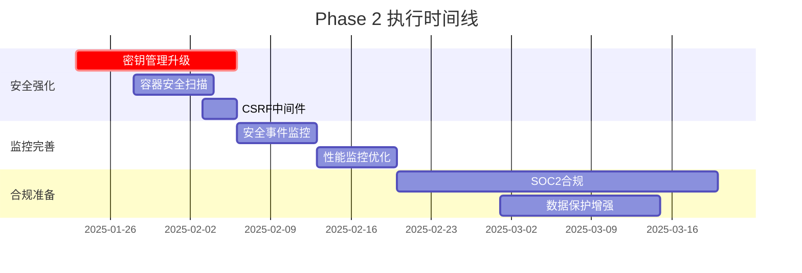

# Phase 2 执行计划
# 下阶段开发与安全强化路线图

## 🎯 执行概览

**计划周期**: 2025-01-23 至 2025-04-22 (3个月)  
**执行原则**: 安全优先、质量保证、渐进增强  
**团队配置**: 建议4-6人小队 (2后端、1前端、1运维、1安全、1测试)



## 📋 详细执行清单

### Week 1-2: 密钥管理系统升级

#### 目标
- 从环境变量迁移到专业密钥管理系统
- 实现密钥自动轮换机制
- 提升安全评分至8.5+

#### 具体任务

**Day 1-2: Vault部署**
```bash
# 1. 部署HashiCorp Vault
docker pull vault:1.15.0
docker run --cap-add=IPC_LOCK -d --name=dev-vault vault:1.15.0

# 2. 初始化Vault
vault operator init
vault operator unseal

# 3. 配置策略
vault policy write collaborative-platform - <<EOF
path "secret/data/jwt/*" {
  capabilities = ["read", "list"]
}
path "secret/data/database/*" {
  capabilities = ["read", "list"] 
}
EOF
```

**Day 3-5: 应用集成**
```go
// shared/vault/client.go
type VaultClient struct {
    client *api.Client
    token  string
}

func (v *VaultClient) GetJWTSecret() (string, error) {
    secret, err := v.client.Logical().Read("secret/data/jwt/primary")
    if err != nil {
        return "", err
    }
    return secret.Data["data"].(map[string]interface{})["key"].(string), nil
}
```

**Day 6-7: 密钥轮换实现**
```go
// shared/vault/rotation.go
func (v *VaultClient) RotateJWTKey() error {
    newKey := generateSecureKey(32)
    
    // 存储新密钥
    _, err := v.client.Logical().Write("secret/data/jwt/primary", map[string]interface{}{
        "data": map[string]interface{}{
            "key": newKey,
            "created_at": time.Now().Unix(),
        },
    })
    return err
}
```

**验收标准**:
- [ ] Vault集群正常运行
- [ ] 所有JWT密钥从Vault获取
- [ ] 密钥轮换功能正常工作
- [ ] 安全评分提升至8.5+

### Week 3: 容器安全扫描集成

#### 目标
- 集成多层容器安全扫描
- 建立CI/CD安全检查点
- 自动化漏洞报告

#### 具体任务

**容器安全扫描配置**
```yaml
# .github/workflows/security-scan.yml
name: 容器安全扫描
on: [push, pull_request]

jobs:
  security-scan:
    runs-on: ubuntu-latest
    steps:
      - uses: actions/checkout@v3
      
      - name: Trivy漏洞扫描
        run: |
          docker run --rm -v $(pwd):/workspace \
            aquasec/trivy:latest filesystem --exit-code 1 /workspace
            
      - name: Hadolint Dockerfile检查
        run: |
          docker run --rm -i hadolint/hadolint < Dockerfile
          
      - name: Docker Bench安全基准
        run: |
          docker run --rm --net host --pid host --userns host --cap-add audit_control \
            -v /etc:/etc:ro \
            -v /usr/bin/docker-containerd:/usr/bin/docker-containerd:ro \
            -v /usr/bin/docker-runc:/usr/bin/docker-runc:ro \
            -v /usr/lib/systemd:/usr/lib/systemd:ro \
            docker/docker-bench-security
```

**安全扫描结果处理**
```go
// internal/security/scanner.go
type SecurityScanResult struct {
    Timestamp    time.Time
    ScanType     string
    Vulnerabilities []Vulnerability
    RiskScore    int
}

func ProcessScanResults(results []SecurityScanResult) {
    for _, result := range results {
        if result.RiskScore > 7 { // 高风险
            // 发送告警
            alerting.SendSecurityAlert(result)
        }
    }
}
```

### Week 4: CSRF保护中间件实现

#### 目标
- 实现标准CSRF保护机制
- 集成到现有认证流程
- 通过安全测试验证

#### 具体实现

**CSRF中间件核心代码**
```go
// shared/middleware/csrf.go
func CSRFProtection(secret string) gin.HandlerFunc {
    return func(c *gin.Context) {
        token := generateCSRFToken(secret, c.ClientIP())
        
        if c.Request.Method == "GET" {
            c.Header("X-CSRF-Token", token)
            c.Next()
            return
        }
        
        clientToken := c.GetHeader("X-CSRF-Token")
        if clientToken == "" {
            clientToken = c.PostForm("csrf_token")
        }
        
        if !validateCSRFToken(clientToken, secret, c.ClientIP()) {
            c.JSON(403, gin.H{"error": "CSRF令牌无效"})
            c.Abort()
            return
        }
        
        c.Next()
    }
}

func generateCSRFToken(secret, clientIP string) string {
    h := hmac.New(sha256.New, []byte(secret))
    h.Write([]byte(clientIP))
    h.Write([]byte(fmt.Sprintf("%d", time.Now().Unix()/300))) // 5分钟窗口
    return hex.EncodeToString(h.Sum(nil))
}
```

### Week 5-6: 安全事件监控系统

#### 目标
- 实时安全事件检测
- 异常行为模式识别
- 自动化响应机制

#### 监控指标配置

**安全事件监控规则**
```yaml
# deployments/monitoring/security-rules.yml
groups:
  - name: security_alerts
    rules:
      - alert: 异常登录检测
        expr: rate(login_failures[5m]) > 10
        for: 1m
        labels:
          severity: warning
        annotations:
          summary: "检测到异常登录尝试"
          
      - alert: 权限提升尝试
        expr: increase(privilege_escalation_attempts[5m]) > 0
        for: 0m
        labels:
          severity: critical
        annotations:
          summary: "检测到权限提升尝试"
          
      - alert: API异常调用
        expr: rate(api_errors[5m]) > 50
        for: 2m
        labels:
          severity: warning
        annotations:
          summary: "API异常调用频率过高"
```

**安全事件处理器**
```go
// internal/security/event_handler.go
type SecurityEventHandler struct {
    alertManager *AlertManager
    logger       *zap.Logger
}

func (h *SecurityEventHandler) HandleEvent(event SecurityEvent) {
    switch event.Type {
    case "login_failure":
        if event.Count > 5 {
            h.alertManager.TriggerAlert("异常登录", event)
        }
    case "privilege_escalation":
        h.alertManager.TriggerCriticalAlert("权限提升尝试", event)
    case "data_access_anomaly":
        h.analyzeDataAccessPattern(event)
    }
}
```

### Week 7-8: 性能监控优化

#### 数据库性能监控
```sql
-- deployments/monitoring/postgres-monitoring.sql
-- 慢查询监控
SELECT query, mean_time, calls, total_time
FROM pg_stat_statements 
WHERE mean_time > 100  -- 超过100ms的查询
ORDER BY total_time DESC;

-- 锁等待监控
SELECT pid, usename, query, state, waiting, query_start
FROM pg_stat_activity 
WHERE waiting = true;
```

#### API性能监控
```go
// shared/middleware/performance.go
func PerformanceMonitoring() gin.HandlerFunc {
    return func(c *gin.Context) {
        start := time.Now()
        
        c.Next()
        
        latency := time.Since(start)
        
        // 记录性能指标
        performanceMetrics.WithLabelValues(
            c.Request.Method,
            c.Request.URL.Path,
            strconv.Itoa(c.Writer.Status()),
        ).Observe(latency.Seconds())
        
        // 慢请求告警
        if latency > 5*time.Second {
            logger.Warn("慢请求检测", 
                zap.String("path", c.Request.URL.Path),
                zap.Duration("latency", latency))
        }
    }
}
```

## 🔧 执行工具和环境

### 开发环境要求
```bash
# 基础工具
- Go 1.21+
- Docker 24.0+
- PostgreSQL 15+
- Redis 7.0+

# 安全工具  
- Trivy (容器扫描)
- Hadolint (Dockerfile检查)
- gosec (Go安全扫描)
- HashiCorp Vault

# 监控工具
- Prometheus 2.40+
- Grafana 9.0+
- AlertManager 0.25+
- Jaeger 1.40+
```

### CI/CD流水线增强
```yaml
# .github/workflows/enhanced-pipeline.yml
name: 增强安全流水线
on: [push, pull_request]

jobs:
  security-checks:
    runs-on: ubuntu-latest
    steps:
      - name: 代码安全扫描
        run: gosec ./...
        
      - name: 依赖漏洞检查
        run: go list -json -deps | nancy sleuth
        
      - name: 许可证合规检查
        run: fossa analyze
        
  build-and-test:
    needs: security-checks
    runs-on: ubuntu-latest
    steps:
      - name: 编译测试
        run: go build ./...
        
      - name: 单元测试
        run: go test -race -coverprofile=coverage.out ./...
        
      - name: 集成测试  
        run: go test -tags=integration ./test/...
        
  deploy-staging:
    needs: build-and-test
    if: github.ref == 'refs/heads/develop'
    runs-on: ubuntu-latest
    steps:
      - name: 部署到测试环境
        run: ./scripts/deploy-staging.sh
        
      - name: 自动化安全测试
        run: ./scripts/security-test.sh
```

## 📊 成功指标和验收标准

### 关键性能指标(KPI)
- **安全评分**: 从7.1提升至8.5+ (目标9.0)
- **漏洞修复时间**: <24小时
- **安全事件响应**: <1小时  
- **API响应时间**: 95%请求<100ms
- **系统可用性**: 99.9%+

### 验收检查清单
- [ ] 密钥管理: Vault集成完成，密钥轮换正常
- [ ] 容器安全: 扫描集成，无高危漏洞
- [ ] CSRF保护: 中间件实现，测试通过
- [ ] 监控告警: 安全事件监控正常工作
- [ ] 性能优化: 响应时间达标
- [ ] 文档完整: 运维手册和应急预案

## 🚨 风险评估和应对

### 主要风险
1. **Vault集成复杂**: 预留额外测试时间
2. **性能影响**: 新增监控可能影响性能
3. **兼容性问题**: 新中间件可能与现有功能冲突

### 应对策略
- 分阶段部署，逐步验证
- 性能基准测试，监控影响
- 完整回滚方案，确保系统稳定

## 📅 里程碑检查点

**Week 2检查点**:
- Vault集成完成度
- 密钥迁移成功率
- 系统稳定性验证

**Week 4检查点**:  
- 安全扫描集成状态
- CSRF保护测试结果
- 安全评分提升情况

**Week 8检查点**:
- 监控系统完整性
- 性能指标达成度
- 整体项目完成度

---

这个执行计划将帮你在3个月内将平台安全性和可靠性提升到企业生产级标准，每个阶段都有明确的交付物和验收标准，确保项目按时按质完成。