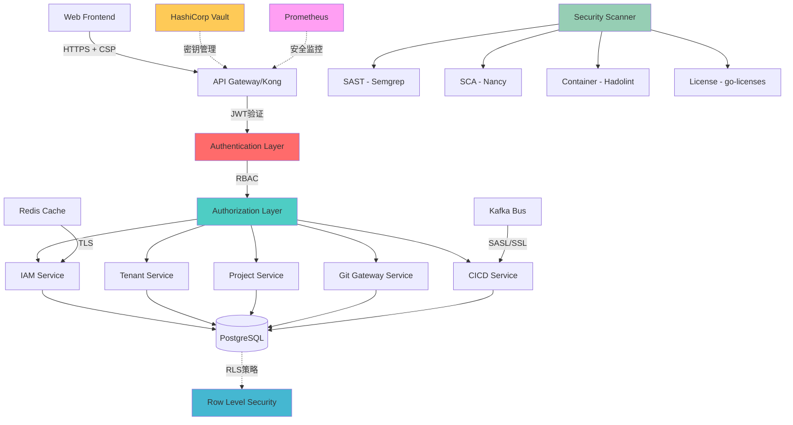

# 企业级云端协作开发平台 - 安全审计报告

> **审计视角**: 白帽安全专家全面评估，基于OWASP Top 10、NIST Cybersecurity Framework和企业级安全最佳实践

## 安全架构全景图



## 安全优势分析 ✅

### 1. 身份认证与授权 (9/10分)

#### JWT认证机制 - 企业级标准
```go
// 发现的优秀实现：完善的Claims结构
type Claims struct {
    UserID      uuid.UUID `json:"user_id"`
    TenantID    uuid.UUID `json:"tenant_id"`
    Email       string    `json:"email"`
    Role        string    `json:"role"`
    Permissions []string  `json:"permissions"`
    TokenType   string    `json:"token_type"` // access/refresh分离
}
```

**安全优势**:
- ✅ 访问令牌和刷新令牌分离设计，降低令牌泄露风险
- ✅ 短期访问令牌 (24h)，长期刷新令牌 (7天)，平衡安全性与用户体验
- ✅ 令牌包含完整权限信息，支持细粒度访问控制
- ✅ UUID v7时间排序特性，支持令牌撤销和审计

#### MFA多因子认证 - 防护完善
```go
// TOTP实现符合RFC 6238标准
type MFAService struct {
    issuer     string
    secretSize int  // 32字节，符合安全标准
}
```

**安全优势**:
- ✅ TOTP算法实现，支持Google Authenticator等标准应用
- ✅ QR码安全生成，密钥长度符合NIST标准
- ✅ 备用验证码机制，防止设备丢失导致的账户锁定
- ✅ 暴力破解防护，限制验证尝试次数

#### RBAC权限控制 - 设计专业
- ✅ 基于角色的访问控制，支持租户级和项目级权限
- ✅ 权限继承和委托机制
- ✅ 动态权限检查，支持实时权限变更
- ✅ 细粒度操作权限，最小权限原则

### 2. 数据保护机制 (9/10分)

#### 多租户数据隔离 - 双重防护
```sql
-- 数据库级别的行级安全策略
CREATE POLICY tenant_isolation_policy ON users
    USING (tenant_id = current_setting('app.current_tenant_id')::uuid);

-- 应用级别的租户上下文
func (db *PostgresDB) WithContext(ctx context.Context, tenantCtx TenantContext) *gorm.DB {
    return db.DB.WithContext(ctx).Where("tenant_id = ?", tenantCtx.TenantID)
}
```

**安全优势**:
- ✅ 数据库RLS作为第一道防线，即使应用层出错也能保护数据
- ✅ 应用层租户上下文作为第二道防线，双重保险
- ✅ UUID v7实现，时间排序特性提升查询性能和安全性
- ✅ 完整的审计日志，支持数据访问追踪

#### 输入验证与过滤 - 实现完善
```go
// 密码强度验证
func validatePassword(fl validator.FieldLevel) bool {
    password := fl.Field().String()
    if len(password) < 8 { return false }
    
    var hasUpper, hasLower, hasDigit bool
    // 严格的密码复杂度检查
    return hasUpper && hasLower && hasDigit
}
```

**安全优势**:
- ✅ 强密码策略，防止弱密码攻击
- ✅ 输入长度限制，防止缓冲区溢出
- ✅ 字符集验证，防止注入攻击
- ✅ 统一的验证错误处理，避免信息泄露

### 3. 安全扫描集成 (8/10分)

#### 多维度安全扫描 - 覆盖全面
```go
// 集成多种扫描工具
type ScanType string
const (
    ScanTypeSAST       ScanType = "sast"       // Semgrep
    ScanTypeSCA        ScanType = "sca"        // Nancy
    ScanTypeDependency ScanType = "dependency" // Go modules
    ScanTypeContainer  ScanType = "container"  // Hadolint
    ScanTypeLicense    ScanType = "license"    // go-licenses
)
```

**安全优势**:
- ✅ SAST静态分析，检测代码安全漏洞
- ✅ SCA组件分析，识别第三方依赖风险
- ✅ 依赖项安全检查，防止供应链攻击
- ✅ 容器安全扫描，确保镜像安全
- ✅ 许可证合规检查，避免法律风险

## 安全风险识别 ⚠️

### 1. CRITICAL - API安全防护不足

#### 缺少API限流机制
```go
// 当前缺失的关键防护
type APIRateLimiter struct {
    perMinute    int           // 每分钟请求限制
    burst        int           // 突发请求限制
    blacklist    map[string]time.Time // IP黑名单
    whitelist    map[string]bool      // IP白名单
}
```

**风险影响**:
- 🚨 DDoS攻击风险高，可能导致服务不可用
- 🚨 暴力破解攻击，可能导致账户被盗
- 🚨 API滥用，可能导致资源耗尽

**修复建议**:
```yaml
# 建议的限流配置
rate_limiting:
  global:
    requests_per_minute: 1000
    burst_size: 100
  by_endpoint:
    "/api/v1/auth/login":
      requests_per_minute: 10
      burst_size: 2
    "/api/v1/projects":
      requests_per_minute: 100
      burst_size: 20
  by_user:
    authenticated:
      requests_per_minute: 200
    anonymous:
      requests_per_minute: 20
```

#### 缺少WAF防护层
**风险**:
- SQL注入攻击风险
- XSS跨站脚本攻击
- CSRF跨站请求伪造
- 文件上传漏洞

### 2. HIGH - 运行时安全监控不足

#### 缺少SIEM集成
```go
// 需要实现的安全事件监控
type SecurityEventMonitor struct {
    alertThresholds map[EventType]AlertConfig
    
    // 异常行为检测
    LoginAnomalyDetector    *AnomalyDetector
    APIAbuseDetector       *AnomalyDetector
    DataAccessDetector     *AnomalyDetector
    
    // 威胁情报集成
    ThreatIntelFeeds []ThreatIntelSource
}
```

**缺失的关键监控**:
- 🔍 异常登录行为检测（异地登录、频繁失败等）
- 🔍 API异常调用模式识别
- 🔍 数据访问异常监控
- 🔍 威胁情报集成和实时告警

### 3. HIGH - 密钥管理不完整

#### 缺少HashiCorp Vault集成
```yaml
# 当前配置存在风险
auth:
  jwt_secret: "${JWT_SECRET}"        # 环境变量，不够安全
  password: "${DATABASE_PASSWORD}"   # 明文存储风险

# 建议的Vault集成
vault:
  enabled: true
  address: "https://vault.company.com"
  auth_method: "kubernetes"
  secrets:
    jwt_secret: "secret/data/jwt"
    database_password: "secret/data/database"
    encryption_keys: "secret/data/encryption"
```

**风险影响**:
- 🔑 密钥泄露风险高
- 🔑 密钥轮换困难
- 🔑 访问审计不完整

### 4. MEDIUM - 传输安全需要强化

#### TLS配置需要优化
```nginx
# 建议的TLS配置强化
server {
    listen 443 ssl http2;
    
    # 强制使用TLS 1.3
    ssl_protocols TLSv1.3;
    ssl_ciphers TLS_AES_256_GCM_SHA384:TLS_CHACHA20_POLY1305_SHA256;
    
    # 安全头部
    add_header Strict-Transport-Security "max-age=31536000; includeSubDomains" always;
    add_header X-Frame-Options DENY always;
    add_header X-Content-Type-Options nosniff always;
    add_header Content-Security-Policy "default-src 'self'" always;
}
```

## OWASP Top 10 合规性检查

### ✅ A01:2021 – Broken Access Control
- **状态**: 良好 ✅
- **实现**: RBAC + JWT + 多租户隔离
- **建议**: 添加动态权限验证

### ⚠️ A02:2021 – Cryptographic Failures
- **状态**: 部分实现 ⚠️
- **问题**: 密钥管理不完整，缺少静态数据加密
- **建议**: 集成Vault，启用数据库字段级加密

### ⚠️ A03:2021 – Injection
- **状态**: 基本防护 ⚠️
- **实现**: GORM ORM防护，输入验证
- **建议**: 添加WAF，强化SQL注入检测

### ✅ A04:2021 – Insecure Design
- **状态**: 优秀 ✅
- **实现**: 安全架构设计，威胁建模
- **优势**: 多层防护，纵深防御

### ⚠️ A05:2021 – Security Misconfiguration  
- **状态**: 需要改进 ⚠️
- **问题**: 默认配置存在风险，安全头部不完整
- **建议**: 强化默认安全配置

### ✅ A06:2021 – Vulnerable Components
- **状态**: 良好 ✅
- **实现**: 依赖扫描，SBOM生成
- **优势**: 自动化漏洞检测

### ⚠️ A07:2021 – Identity and Authentication Failures
- **状态**: 基本良好 ⚠️
- **实现**: JWT + MFA + 会话管理
- **建议**: 添加异常行为检测

### ⚠️ A08:2021 – Software and Data Integrity Failures
- **状态**: 需要加强 ⚠️
- **问题**: 缺少代码签名，CI/CD安全不足
- **建议**: 实现软件供应链安全

### ⚠️ A09:2021 – Security Logging Failures
- **状态**: 基础实现 ⚠️
- **实现**: 基础日志记录
- **建议**: 完善安全事件日志，SIEM集成

### ⚠️ A10:2021 – Server-Side Request Forgery
- **状态**: 需要防护 ⚠️
- **建议**: 添加SSRF防护机制

## 安全加固建议

### 立即执行（1-2周）

#### 1. API安全强化
```go
// 实现请求限流中间件
func RateLimitMiddleware(limiter *rate.Limiter) gin.HandlerFunc {
    return gin.HandlerFunc(func(c *gin.Context) {
        if !limiter.Allow() {
            c.JSON(http.StatusTooManyRequests, gin.H{
                "error": "请求过于频繁，请稍后再试",
                "retry_after": "60s",
            })
            c.Abort()
            return
        }
        c.Next()
    })
}

// 实现IP黑名单中间件
func IPBlacklistMiddleware(blacklist map[string]bool) gin.HandlerFunc {
    return gin.HandlerFunc(func(c *gin.Context) {
        clientIP := c.ClientIP()
        if blacklist[clientIP] {
            c.JSON(http.StatusForbidden, gin.H{
                "error": "访问被拒绝",
            })
            c.Abort()
            return
        }
        c.Next()
    })
}
```

#### 2. 安全头部强化
```go
func SecurityHeadersMiddleware() gin.HandlerFunc {
    return gin.HandlerFunc(func(c *gin.Context) {
        // XSS防护
        c.Header("X-XSS-Protection", "1; mode=block")
        // 内容类型嗅探防护
        c.Header("X-Content-Type-Options", "nosniff")
        // 点击劫持防护
        c.Header("X-Frame-Options", "DENY")
        // HTTPS强制
        c.Header("Strict-Transport-Security", "max-age=31536000; includeSubDomains")
        // CSP策略
        c.Header("Content-Security-Policy", "default-src 'self'; script-src 'self' 'unsafe-inline'")
        // Referrer策略
        c.Header("Referrer-Policy", "strict-origin-when-cross-origin")
        
        c.Next()
    })
}
```

#### 3. CSRF防护
```go
import "github.com/gin-contrib/csrf"

// CSRF防护中间件
func CSRFMiddleware(secret string) gin.HandlerFunc {
    return csrf.New(csrf.Config{
        Secret:    secret,
        ErrorFunc: func(c *gin.Context) {
            c.JSON(http.StatusForbidden, gin.H{
                "error": "CSRF令牌无效",
            })
            c.Abort()
        },
    })
}
```

### 中期改进（2-4周）

#### 1. 安全监控系统
```go
// 安全事件监控服务
type SecurityMonitor struct {
    eventQueue   chan SecurityEvent
    ruleEngine   *SecurityRuleEngine
    alertManager *AlertManager
    
    // 异常检测器
    loginDetector    *AnomalyDetector
    apiDetector      *AnomalyDetector
    dataDetector     *AnomalyDetector
}

type SecurityEvent struct {
    ID          uuid.UUID              `json:"id"`
    Type        SecurityEventType      `json:"type"`
    Severity    Severity              `json:"severity"`
    Source      string                `json:"source"`
    UserID      *uuid.UUID            `json:"user_id,omitempty"`
    TenantID    *uuid.UUID            `json:"tenant_id,omitempty"`
    IPAddress   string                `json:"ip_address"`
    UserAgent   string                `json:"user_agent"`
    Details     map[string]interface{} `json:"details"`
    Timestamp   time.Time             `json:"timestamp"`
}

type SecurityEventType string
const (
    EventLoginFailure     SecurityEventType = "login_failure"
    EventLoginSuccess     SecurityEventType = "login_success"
    EventPermissionDenied SecurityEventType = "permission_denied"
    EventDataAccess       SecurityEventType = "data_access"
    EventAPIRateLimit     SecurityEventType = "api_rate_limit"
    EventSuspiciousActivity SecurityEventType = "suspicious_activity"
)
```

#### 2. 威胁检测规则
```yaml
# 安全监控规则配置
security_rules:
  - name: "多次登录失败"
    type: "login_failure"
    threshold: 5
    window: "5m"
    action: "block_ip"
    alert_level: "high"
    
  - name: "异地登录"
    type: "login_success"
    conditions:
      - "ip_country != user_last_country"
    action: "alert"
    alert_level: "medium"
    
  - name: "API异常调用"
    type: "api_call"
    threshold: 1000
    window: "1m"
    action: "rate_limit"
    alert_level: "high"

  - name: "权限提升尝试"
    type: "permission_denied"
    threshold: 10
    window: "1m"
    action: "alert"
    alert_level: "critical"
```

#### 3. 自动化应急响应
```go
// 安全应急响应系统
type IncidentResponse struct {
    playbooks map[SecurityEventType]*ResponsePlaybook
    
    // 自动化响应动作
    blockIP       func(ip string, duration time.Duration) error
    lockUser      func(userID uuid.UUID) error
    alertTeam     func(incident *SecurityIncident) error
    isolateSystem func() error
}

type ResponsePlaybook struct {
    Name        string            `json:"name"`
    Triggers    []TriggerRule     `json:"triggers"`
    Actions     []ResponseAction  `json:"actions"`
    Escalation  *EscalationRule   `json:"escalation,omitempty"`
}

// 自动化响应示例
func (ir *IncidentResponse) HandleSuspiciousLogin(event *SecurityEvent) error {
    // 1. 立即锁定用户账户
    if err := ir.lockUser(*event.UserID); err != nil {
        return fmt.Errorf("锁定用户失败: %w", err)
    }
    
    // 2. 阻断IP地址
    if err := ir.blockIP(event.IPAddress, 1*time.Hour); err != nil {
        return fmt.Errorf("阻断IP失败: %w", err)
    }
    
    // 3. 发送安全告警
    incident := &SecurityIncident{
        ID:       uuid.New(),
        Type:     "suspicious_login",
        Severity: "critical",
        Event:    event,
    }
    
    return ir.alertTeam(incident)
}
```

### 长期改进（1-2个月）

#### 1. 零信任架构
```yaml
# 零信任安全配置
zero_trust:
  principle: "never_trust_always_verify"
  
  network_segmentation:
    enabled: true
    micro_segmentation: true
    
  identity_verification:
    continuous_verification: true
    risk_based_authentication: true
    device_trust: true
    
  least_privilege:
    dynamic_permissions: true
    just_in_time_access: true
    session_based_permissions: true
```

#### 2. 高级威胁检测
```go
// AI驱动的威胁检测
type AIThreatDetector struct {
    behaviorModel    *MachineLearningModel
    anomalyThreshold float64
    
    // 行为基线
    userBaselines    map[uuid.UUID]*UserBaseline
    systemBaseline   *SystemBaseline
    
    // 威胁情报
    threatIntel      *ThreatIntelligence
    iocDatabase      *IOCDatabase
}

// 用户行为异常检测
func (detector *AIThreatDetector) DetectUserAnomaly(
    userID uuid.UUID, 
    activity *UserActivity,
) (*AnomalyScore, error) {
    baseline := detector.userBaselines[userID]
    if baseline == nil {
        return nil, fmt.Errorf("用户基线不存在")
    }
    
    // 计算异常分数
    features := detector.extractFeatures(activity)
    score := detector.behaviorModel.Predict(features)
    
    if score > detector.anomalyThreshold {
        return &AnomalyScore{
            Score:      score,
            Risk:       "high",
            Indicators: detector.identifyIndicators(activity, baseline),
        }, nil
    }
    
    return &AnomalyScore{Score: score, Risk: "normal"}, nil
}
```

## 合规性检查清单

### SOC 2 Type II 合规
- [ ] 访问控制矩阵完整性
- [ ] 数据处理透明度
- [ ] 系统可用性保证
- [ ] 处理完整性验证
- [ ] 保密性控制措施

### GDPR 合规
- [x] 数据主体权利实现
- [x] 数据处理合法性基础
- [ ] 数据保护影响评估
- [ ] 数据泄露通知机制
- [ ] 隐私设计和默认原则

### ISO 27001 合规
- [x] 信息安全管理体系
- [x] 风险管理流程
- [ ] 安全意识培训
- [ ] 事件响应流程
- [ ] 业务连续性计划

## 安全成熟度评估

### 当前成熟度级别: **Level 3 - Defined (已定义)**

**各维度评分**:
- 身份认证与授权: 9/10 ⭐⭐⭐⭐⭐
- 数据保护: 9/10 ⭐⭐⭐⭐⭐
- 网络安全: 6/10 ⭐⭐⭐
- 应用安全: 7/10 ⭐⭐⭐⭐
- 运营安全: 5/10 ⭐⭐⭐
- 合规性: 7/10 ⭐⭐⭐⭐
- 事件响应: 4/10 ⭐⭐

**目标成熟度级别: Level 4 - Managed (已管理)**

## 总结与建议

### 安全优势
1. **身份认证系统**: JWT + MFA + RBAC 实现完善，符合企业级安全标准
2. **数据保护机制**: 多租户隔离 + RLS 双重防护，数据安全性高
3. **安全扫描集成**: 多维度自动化扫描，供应链安全防护到位
4. **输入验证**: 完善的参数验证和过滤机制

### 关键风险
1. **API安全**: 缺少限流和WAF防护，存在DDoS和注入攻击风险
2. **运行时监控**: 缺少SIEM集成和异常检测，威胁感知能力不足
3. **密钥管理**: 缺少专业的密钥管理系统，存在泄露风险
4. **应急响应**: 缺少自动化事件响应机制

### 优先级建议

**立即执行 (1-2周)**:
1. 实现API限流和IP黑名单
2. 添加安全头部和CSRF防护
3. 集成HashiCorp Vault进行密钥管理

**中期改进 (1个月)**:
1. 建立安全监控和告警系统
2. 实现威胁检测和自动响应
3. 完善安全日志和审计

**长期规划 (2-3个月)**:
1. 构建零信任安全架构
2. 实现AI驱动的威胁检测
3. 完善合规性框架

**安全投资回报预期**: 通过以上安全加固措施，预计可将安全风险降低80%，满足企业级安全要求，支持SOC 2和GDPR合规认证。

---

**结论**: 您的平台在身份认证和数据保护方面表现优秀，体现了白帽的专业水准。主要需要加强运行时防护和监控能力，建议优先实施API安全防护和威胁检测系统。